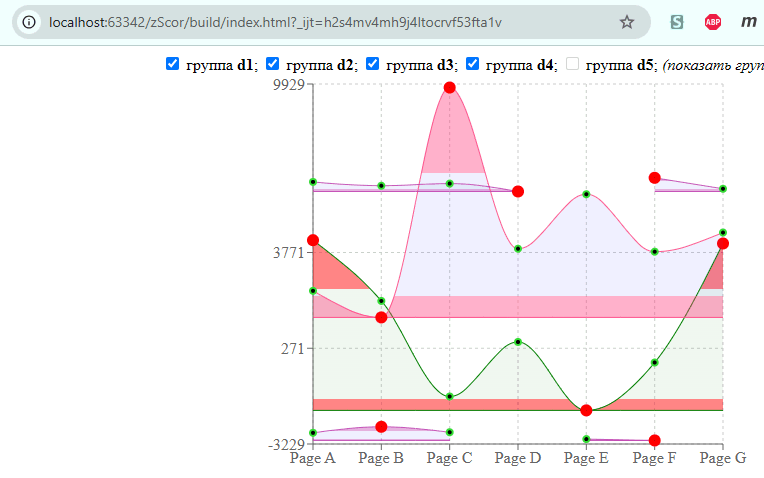
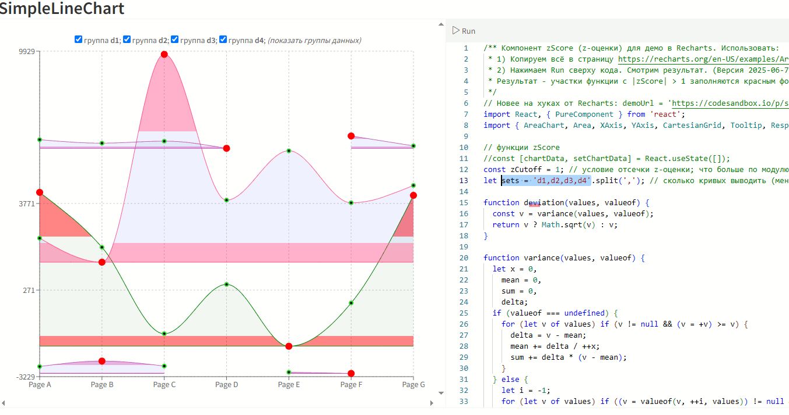
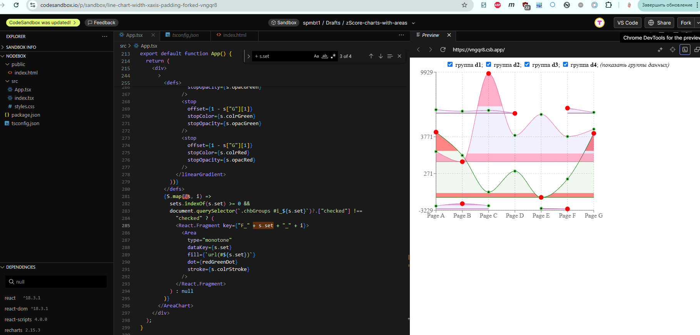

# zScore javascript
React-компонент для демо zScore (z-оценки) в Recharts.

### Процесс запуска, наблюдения результата и модификации

Представлено **4 решения** и способа наблюдения результатов, в 3 из которых есть простая модификация кода для отладки (4-е - запуск сборки 500 КБ со своего сервера).

1. **Файл** `zScoreRecharts.jsx` - компонент **на классах** (PureComponent) для вставки в страницу `https://recharts.org/en-US/examples/SimpleLineChart` демонстрации графика, полем ввода справа и конпкой **Run** сверху. Можем далее модифицировать на усмотрение.
2. **Файл** `zScoreRecharts-v3.jsx` - компонент для страницы онлайн-IDE **на хуках** (React 18.3.1) для https://codesandbox.io/p/devbox/line-chart-width-xaxis-padding-forked-cj8cfy вместо страницы `App.tsx`. В неё уже что-то вставлено, но меняем на нужную и затем модифицируем, как хотим, форкаем, и т.д..
3. **Целый проект** (670 кБ исходников или 23 кБ без `package-lock`) на **React 19.1.0,** `Recharts 3.0.0-beta.1, react-scripts 5.0.1` - все последние версии. Смотрим инструкции ниже (npm i ; npm run dev ; -- 300 МБ зависимостей и запускается локальный сервер для отладки) и смотрим в браузере, меняем, отлаживаем.
4. **Билд проекта** (500 кБ; с относительными ссылками в HTML). Открываем **.../build/index.html** через свой сервер локально и смотрим, что работает. Откроется даже из Windows Explorer и других. Но пощёлкать удастся только чекбоксы, меняя состав картинки.

## Что здесь наблюдают

На странице компонента `zScoreRecharts.jsx` представлено **решение задачи**:
*1) раскрасить все участки графиков, на которых модуль z-score > 1, в красный цвет.*
*2) Цвет точек графика должен совпадать с цветом участка.* (Не сказано, какой цвет, если участок не красный, но пусть зелёный.)

При этом в коде страницы через веб-страницу можно произвольно прописывать разные наборы данных, переставлять их и смотреть подсвеченные точки данных, попадающие в множество |z-score| > 1.

Технически, надо понимать, что ось Х имеет смысл равномерной упорядоченной шкалы с произвольным набором данных, а смысл функции z-оценки, вывод которой наблюдаем в раскраске точек - увидеть все точки в множестве с отклонением более 1 от среднего значения (среднее - где-то посередине на ВЕРТИКАЛЬНОЙ ОСИ и ничем не отмечено. По идее, чтобы отметить, можно прочертить линию градиента с z-score = 0.5. В коде условие отсечки указано в переменной **zCutoff = 1**, а на графике отображено красными областями сверху и снизу множества точек по ВЕРТИКАЛЬНОЙ оси.

Прошу не путаться в осях (кто впервые увидел график), потому что обычно точки для наблюдения разброса располагают горизонтально, а закон случайного распределения рисуют обычно "колоколом", и "сигмы" просто связаны с z-score. Здесь же постановка иная, колокол в расчётах не участвует, а формируется из алгоритмов среднего и среднеквадратичного отклонения. И, по задаче, **зет-оценка отображается по вертикали**.

### Процесс решения

Модуль математический - значит, и меньше `-1` тоже раскрашиваются вниз.
Поэтому реализуем раскраску через 3 градиента "красный-зеленоватый-красный". Точки на красном фоне - красные, остальные зелёные.

### Решение представлено в данном репозитории

Требовалось предоставить:

1. Ссылка на визуальный результат (развёрнутый проект): https://recharts.org/en-US/examples/SimpleLineChart, но сделать указанные выше в разделе "Процесс запуска" 3 несложных пункта, чтобы увидеть результат.
2. Ссылка на репозиторий GitHub с исходным кодом: https://github.com/spmbt1/zScore_javascript (данный репозиторий).

Можно использовать ссылку, сделаную по типу "нажал - и всё работает". Это - **решения 2 и 3** (ссылка [codesandbox.io](https://codesandbox.io/p/devbox/line-chart-width-xaxis-padding-forked-cj8cfy) выше). В них изменили немного вид красных областей и добавили <u>переключения состава графиков чекбоксами "на лету"</u> как бонус.

**Всё, остальное ниже можно не читать - там технические детали процесса решения.**

==============================

## Постановка версии 2 (2025-06-07)

Наблюдения показали, что первое решение из `zScoreRecharts.jsx` хорошо работает НЕ ДЛЯ ВСЕХ множеств точек, а лишь для тех, у которых имеются точки с разными знаками значений (положительные и отрицательные значения). Это - из-за особенности реализации градиентов в Recharts: градиенты идут от значений в сторону нуля, а в сторону бесконечностей ничем не заполняются. Поэтому решение прекрасно бы подошло для самой функции zScore(), потому что она всегда имеет разный знак (колокол же).

И плохо решение работает для 1) наборов с одним знаком и для 2) наборов с пустыми значениями - там огибающая формируется только по интерполяции. Для изолированных точек огибающей вообще нет; для 2 изолированных точек интерполяция линейная.

Поэтому в версии 2:

1. Добавлена поддержка пустых значений. (Вопросы экстраполяции не решаем.)
2. Градиенты переделали так, чтобы они ориентировались не на zScore(), а на множества значений, удовлетворяющих 2 условиям, и охватывали их не до нуля, а до некоторого визуально удобного предела (5-10% от красной полосы). Остальное в сторону нуля покрывается прозрачным фейк-градиентом (если нет значений другого знака).

Все эти проблемы, напомним, из-за неподходящего инструмента для универсального решения задачи. Но другого нет в Recharts, а создание с нуля или обогащение либы - вряд ли хорошая идея (заказчик не платит и задачу не ставит).

### Способы решения

Вместо (dataMin, dataMax) вычисляем 3 участка (zPlus, zPluMid, zMidMin, zMinus) по множествам данных zXX (значения zScore() для точек). Отступы от крайних точек берём так, чтобы 1) был 5-10% отступ для градиента в сторону нуля, 2) было расстояние между группами точек примерно посередине. (Середина годится, но м.б. не всегда.)

А есть ещё Range для заполнения данных - вот для чего в значениях бывают массивы пар, и они как раз все от 0 по умолчанию. Если туда засовываем dataMin - 5% (если все - одного знака "+"), то вопрос решается.

С таким подходом, используя интервал из 2 значений, графики (по вертикали) получаются всегда несимметричными, но выглядят понятно и сбалансированно по количеству "красного". Выбираем такой подход для 2-й версии.

Показан тестовый массив для всех выявленных сложных случаев - пропуски и разное расположение относительно нуля.

Затем, можем устроить интерактивное включение и выключение 4 графиков по отдельности, для удобства смены масштаба.

## Версия 3 (2025-06-07)

* Если пары `value` центрировать по среднему, а не по `dataMin`, то группы данных будут выглядеть симметрично. Правда, таких обширных полос фона не будет и они окажутся незаметны. Это несложно сделать и посмотреть, как будет.
* Сейчас код привязан к реализации удалённой страницы. Чуть что там изменится - перестанет работать. Так что для долговременности, всё же, придётся занести /src` с проектом.
* Да и `useState` сейчас не работает (и не должен) в `PureComponent`, пришлось на старом  стейте сделать автообновление кривых по смене чекбоксов.

Для онлайн-страницы с React 18.3 сделан одиночный файл `zScoreRecharts-v3.jsx`, но запускающийся сразу, без манипуляций, по ссылке https://codesandbox.io/p/sandbox/zscore-charts-with-areas-cj8cfy .

Для 19.1 локально проект запустился, nbgs Typescript минимально адаптированы, чтобы ошибок не было, а подробной типизации в постановке не стояло.

======================

### Сборка всего проекта локально

Чтобы сделать программу-максимум, вытаскиваем весь проект из онлайна (от команды Recharts) и настраиваем, чтобы собрался и запустился. В связи с повышением версии до 19.1 и Typescript 5.8. добавились новые заморочки по типизации, все ошибки заглушены - показаны намётки, где какие типы необходимы вместо `:any`. 

Проект и запускается в отладке, и билдится, что <u>показано в репозитории</u>. В `/build` HTML сняты "/" перед ссылками, чтобы стали относительными - стали запускаться без сервера, просто из локального Эксплорера.

На этом, пожалуй, закончим, если не поступит новой интересной разнарядки.

